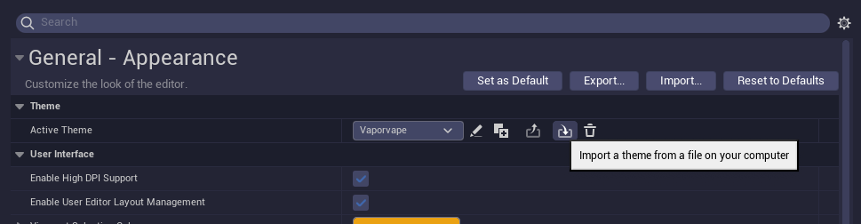

# Unreal editor theme collection
A small collection of themes for unreal. Download the theme you want and go to
`General -> Appearance -> Active Theme` and import the theme from the downloaded
location.


## Light


## Lighter


## VaporWave


## OneGray


## OneGrayDarker


## OneDark


## Steam


# Known issues

If you encounter the error `"Import theme failed"` check if following folder exists, if not
create it and retry.
```sh
C:\Users\<USER_NAME>\AppData\Local\UnrealEngine\Slate\Themes\
```

# Contribute
Feel free to open a PR

# Credits
Some of the themes can be found here https://forums.unrealengine.com/t/small-theme-pack-for-ue-5-1/675958.

Other interesting themes:
- https://github.com/dracula/unreal-engine.git
- https://github.com/catppuccin/unreal-engine
